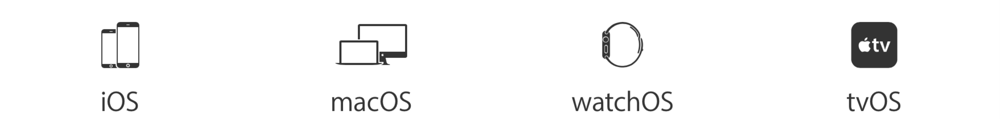

  

  This is a list of tools I use for iOS, macOS, watchOS, and tvOS development

  
  
  
  
  

| Tool | Website | Description |
| --- | --- | --- |
| Airtool | [https://www.adriangranados.com/apps/airtool](https://www.adriangranados.com/apps/airtool) | Free menubar tool to diagnose your Mac's WiFi |
| Bezel | [http://infinitapps.com/bezel/](http://infinitapps.com/bezel/) | Bezel is a free developer tool for Apple Watch developers who are running their apps in the iOS Simulator. |
| Carthage | [https://github.com/Carthage/Carthage](https://github.com/Carthage/Carthage) | Carthage is intended to be the simplest way to add frameworks to your Cocoa application. |
| Charles Proxy | [https://www.charlesproxy.com](https://www.charlesproxy.com) | Charles is an HTTP proxy / HTTP monitor / Reverse Proxy that enables a developer to view all of the HTTP and SSL / HTTPS traffic between their machine and the Internet. |
| CocoaPods | [http://cocoapods.org](http://cocoapods.org) | CocoaPods is a dependency manager for Swift and Objective-C Cocoa projects. |
| gfxCardStatus | [https://gfx.io](https://gfx.io) | gfxCardStatus is an unobtrusive menu bar app for OS X that allows MacBook Pro users to see which apps are affecting their battery life by using the more power-hungry graphics. |
| Hardware I /O Tools for Xcode| [https://developer.apple.com/downloads](https://developer.apple.com/downloads) | This package includes additional hardware i/o tools formerly bundled in the Xcode installer. These tools include: Apple Bluetooth Guidelines Validation, Bluetooth Explorer, HomeKit Accessory Simulator, IO Registry Explorer, Network Link Conditioner.prefpane, PacketLogger and Printer Simulator. |
| Hopper | [https://www.hopperapp.com](https://www.hopperapp.com) | Hopper is a reverse engineering tool for OS X and Linux, that lets you disassemble, and decompile your 32/64bits Intel Mac, Linux, Windows and iOS executables! |
| iOS Console | [http://lemonjar.com/iosconsole/](http://lemonjar.com/iosconsole/) | The most awesome iOS console log viewer. Ever. |
| iOS Signer App | [http://dantheman827.github.io/ios-app-signer/](http://dantheman827.github.io/ios-app-signer/) | This is an app for OS X that can (re)sign apps and bundle them into `.ipa` files that are ready to be installed on an iOS device. Supported input types are: `.ipa`, `.deb`, `.app`, `.xcarchive` |
| Kaleidoscope | [http://www.kaleidoscopeapp.com](http://www.kaleidoscopeapp.com) | Easily spot the differences in text and image files. Review changes in seconds with the world's most advanced Mac diff tool. |
| libimobiledevice | [http://www.libimobiledevice.org](http://www.libimobiledevice.org) | libimobiledevice is a cross-platform software library that talks the protocols to support iPhone®, iPod Touch®, iPad® and Apple TV® devices.|
| PaintCode | [http://www.paintcodeapp.com](http://www.paintcodeapp.com) | Turn drawings into code |
| Paw | [https://luckymarmot.com/paw](https://luckymarmot.com/paw) | The most advanced HTTP client for Mac |
| Pixel Winch | [https://www.ricciadams.com/projects/pixel-winch](https://www.ricciadams.com/projects/pixel-winch) | Pixel Winch is a screen measurement app with a unique approach. It combines aspects of a traditional image editor with the quick access of a modal interface. |
| Wireshark | [https://www.wireshark.org](https://www.wireshark.org) | Wireshark is the world's foremost network protocol analyzer. It lets you see what's happening on your network at a microscopic level |
